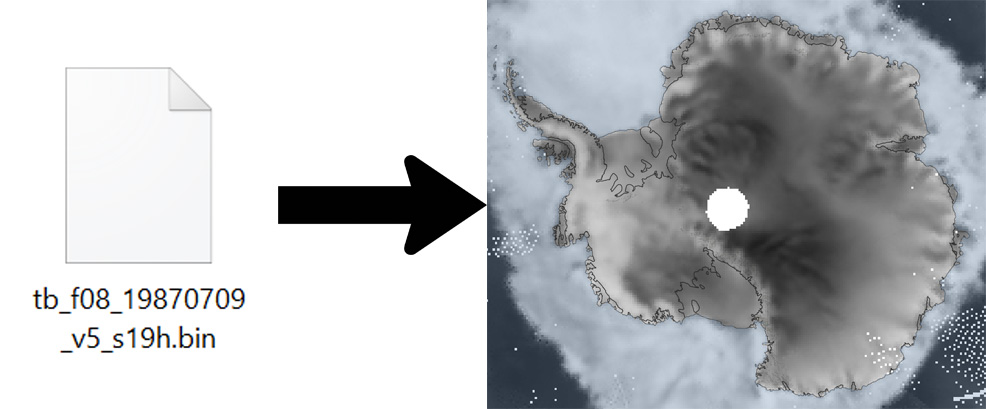

# NSIDC_file_reader

Scripts for reading and exporting various National Snow &amp; Ice Data Center ([NSIDC](https://nsidc.org/)) flat binary (.bin) data files.

Many of NSIDC's files comes with IDL .pro scripts to read and/or plot them, but without IDL (a closed-source programming environment), you have to just figure it out yourself. Here are some simple Python scripts with command-line interfaces for easily reading and exporting the data yourself. You shouldn't need to edit the files (unless you want to develop it further or work out a bug, in which case please submit a pull request!), you should just be able to run them from the command line.

Two files are included here. They both have command-line interfaces, or you can import the functions from the scripts and use them with your Python code.

### convert_bin_to_gtif.py
    usage: convert_bin_to_gtif.py [-h] [-dest DEST] [-resolution RESOLUTION]
                                  [-hemisphere HEMISPHERE] [-nodata NODATA]
                                  [-header_size HEADER_SIZE]
                                  [-element_size ELEMENT_SIZE]
                                  [-output_type OUTPUT_TYPE]
                                  [-multiplier MULTIPLIER] [--signed] [--verbose]
                                  src
    
    Outputs a geo-referenced TIF (.tif) from an NSDIC flat binary (.bin) data
    file.
    
    positional arguments:
      src                   Source file (.bin)
    
    optional arguments:
      -h, --help            show this help message and exit
      -dest DEST            Destination file (.tif). Default: Write the same
                            filename in the same location with a .tif extension
                            rather than .bin.
      -resolution RESOLUTION, -r RESOLUTION
                            Resolution (km): 6.25, 12.5, or 25. If omitted, it is
                            interpreted from the file name. If cannot be
                            interpreted, defaults to 25 km. Check your NSIDC data
                            source documentation.
      -hemisphere HEMISPHERE
                            Hemisphere: one letter, N or S. If omitted, it is
                            interpreted from the file name. If cannot be
                            interpreted, defaults to 'N'.
      -nodata NODATA, -nd NODATA
                            Nodata value. Can be a number, or 'None' (without the
                            quotes). (Default: None)
      -header_size HEADER_SIZE, -hs HEADER_SIZE
                            Size of .bin file header (in bytes). (Default: 0)
      -element_size ELEMENT_SIZE, -es ELEMENT_SIZE
                            Size of each numerical .bin data element (in bytes).
                            Typically 1 or 2 for NSIDC files. (Default: 2)
      -output_type OUTPUT_TYPE, -ot OUTPUT_TYPE
                            Output data type: 'int' or 'float'. Default 'float'.
      -multiplier MULTIPLIER, -m MULTIPLIER
                            Use a multiplier. With 'auto', defaults to 1 (no mod)
                            for integer output and 0.1 for floating-point (2731 ->
                            273.1). If you want to use a different multiplier, put
                            the number here.
      --signed, -s          If set, read binary data as signed numbers. (Default:
                            unsigned)
      --verbose, -v         Increase output verbosity.

### read_bin.py
    usage: read_bin.py [-h] [-resolution RESOLUTION] [-hemisphere HEMISPHERE]
                       [-header_size HEADER_SIZE] [-element_size ELEMENT_SIZE]
                       [-output_type OUTPUT_TYPE] [-multiplier MULTIPLIER]
                       [--signed]
                       src
    
    Reads an NSIDC .bin file and outputs the array contents. Use
    'convert_bin_to_gtif.py' to output to a GeoTiff. This will just spit the
    numbers onto a screen. In order to output to a space-delimited text file, just
    route the stdout into a file. Example: 
    
                                $ python read_bin.py infile.bin > outfile.txt
    
    Read the NSIDC documentation for your data product in order to
    choose the correct parameters listed below.
    
    positional arguments:
      src                   Source file (.bin)
    
    optional arguments:
      -h, --help            show this help message and exit
      -resolution RESOLUTION, -r RESOLUTION
                            Resolution (km): 6.25, 12.5, or 25. If omitted, it is
                            interpreted from the file name. If cannot be
                            interpreted, defaults to 25 km. Check your NSIDC data
                            source documentation.
      -hemisphere HEMISPHERE
                            Hemisphere: N or S. If omitted, it is interpreted from
                            the file name. If cannot be interpreted, defaults to
                            'N'.
      -header_size HEADER_SIZE, -hs HEADER_SIZE
                            Size of .bin file header (in bytes.) (Default: 0)
      -element_size ELEMENT_SIZE, -es ELEMENT_SIZE
                            Size of each numerical .bin data element, in bytes.
                            Most NSIDC files use 1- or 2-byte numbers. Check the
                            documentation of the dataset. (Default: 2)
      -output_type OUTPUT_TYPE, -ot OUTPUT_TYPE
                            Output data type: 'int' or 'float'. Default 'int'.
      -multiplier MULTIPLIER, -m MULTIPLIER
                            A multiplier to create the output numbers. Any number,
                            or 'auto'. With 'auto', defaults to 1 for integers (no
                            modification) and 0.1 for floating-point (2731 becomes
                            273.1, e.g.). Or, specify your own multiplier here.
      --signed, -s          Read bin as signed data. Default to unsigned.

**Requirements:**

A working python3 installation with the following libraries installed:

  * numpy
  * osgeo (with associated gdal library and bindings)

**Notes:**

These functions have not been exhaustively tested for all different types of NSIDC .bin data products. They have been tested and seem to work with [NSIDC-0001](https://nsidc.org/data/NSIDC-0001/), [NSIDC-0051](https://nsidc.org/data/nsidc-0051), and [NSIDC-0079](https://nsidc.org/data/nsidc-0079) files. If you are using other .bin data files for which this code doesn't seem to work, please submit an issue request and I will try to update the code to accomodate. (Or better yet, submit a pull request and suggest updates to the code!)

The [convert_bin_to_gtif.py](#convert_bin_to_gtifpy) file depends upon the [read_bin.py](#read_binpy) file. They should be kept in the same directory.

**Credit and Lisense**

Distributed freely under the [GPL3.0 license](https://www.gnu.org/licenses/gpl-3.0.en.html).

Created by Mike MacFerrin, University of Colorado ([email](mailto:michael.macferrin@colorado.edu)).

If this code is used in a research work or publication, a quick acknowledgement at the end/footnote of the work is requested.

If you would like to show your appreciation by buying me a coffee, feel free to hit my [PayPal](https://paypal.me/MikeMacFerrin) or [Venmo](www.venmo.com/Mike-MacFerrin). :blush: